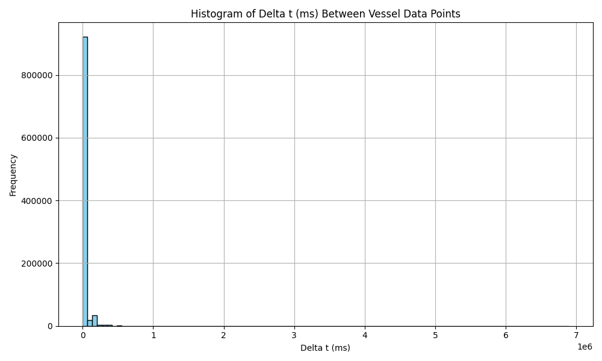
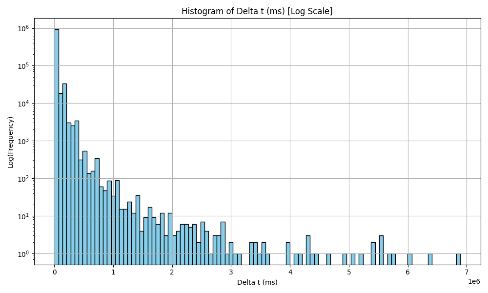

# NoSQL Database Cluster with AISdata
 ASSINGMENT 3 - Big Data Analysis

`project3.py` - wrapper code that runs all tasks

`constants.py` - holds all defined constants (file_path, chunk_size, collection names, mongodb connection, etc...)

`utils.py` - libraries and function definitions.

`output/` - code outputs (summary and plots)

# TASK 1

To run the code for Task 1, it is important to have the correct folder setup so that Docker and MongoDB can cooperate.

## Folder setup:
BDSproject3

* docker-compose.yml
* setup_mongo_cluster.sh
* project3.py
* aisdk-2023-05-01.csv
* init-scripts
  * initiate-config.js
  * initiate-shard1.js
  * initiate-shard2.js
  * initiate-shards.js

When running setup_mongo_cluster.sh, folders db, configdb and data with subfolders (config1, config2, config3, shard1, and shard2) will be added to your setup, as well as a datafile ais_sample_1M.csv (the first 1,000,000 rows of data used for testing).

## Steps to run:
In the terminal, run:
```
./setup_mongo_cluster.sh
```
This will set up the MongoDB sharded cluster with sharded AIS data.

### Troubleshooting:
If step 2 does not work, try the following command:
```
chmod +x setup_mongo_cluster.sh
```
This will ensure that you have execution permission for setup_mongo_cluster.sh. After running this command, retry 
./setup_mongo_cluster.sh

# Documentation: MongoDB Sharded Cluster Setup (Task 1)

## Table of contents
* 1.0 MongoDB cluster setup
  * 1.1 Config servers and mongos router
  * 1.2 Shards
  * 1.3 Registering shards with mongos
  * 1.4 Testing sharding

* 2.0 Adding replica sets to the shards
  * 2.1 Summary of adding replica sets
  * 2.2 Modifications
 
* 3.0 Automating and loading the Data
  * 3.1 Automating with setup_mongo_cluster.sh
  * 3.2 Sharding configuration in MongoDB
  * 3.3 Importing ais data to MongoDB

# 1.0 MongoDB cluster setup

## 1.1 Config servers and mongos router

The first step was to define the MongoDB sharded cluster using Docker Compose. We created a docker-compose.yml file with the following components:

* Config Servers (config1, config2, config3): Each running MongoDB as a config server with replica sets. These manage the metadata and routing information for the sharded cluster. Three config servers are necessary for redundancy and fault tolerance.
* Mongos Router: Entry point for routing queries, connected to the config servers. When setup is finished, the mongos router will handle client requests and forwards them to the appropriate shard. 

The config servers were initialised with initiate-config.js:
```
rs.initiate({
    _id: "configReplSet",
    configsvr: true,
    members: [
        { _id: 0, host: "config1:27017" },
        { _id: 1, host: "config2:27017" },
        { _id: 2, host: "config3:27017" }
    ]
});
```

## 1.2 Shards
Two shards (shard1, shard2) were defined, each as a single-node replica set:
```
rs.initiate({
    _id: "shard1ReplSet",
    members: [
        { _id: 0, host: "shard1:27017" }
    ]
});
```
```
rs.initiate({
    _id: "shard2ReplSet",
    members: [
        { _id: 0, host: "shard2:27017" }
    ]
});
```
Different from the config servers the shards in our MongoDB sharded cluster are essentially both separate replica sets. Therefore they need to be initiated seperatly. This is the reason we needed to add two scripts, initiate-shard1.js and initiate-shard2.js. They initialise each shard’s replica set individually, and then adds them to the cluster. Each shard will have its own replica set (shard1ReplSet and shard2ReplSet), so these scripts contain the necessary commands to set them up and configure them properly.

We added the shards using initiate-shards.js:
```
sh.addShard("shard1ReplSet/shard1:27017");
sh.addShard("shard2ReplSet/shard2:27017");
```

## 1.3 Registering shards with mongos
Next, we wanted to register the shards with the mongos router using the initiate-shards.js script. Since the mongos container did not initially have access to the initialisation scripts, we added the init-scripts volume to the mongos service in the docker-compose.yml file:
```
    volumes:
      - ./init-scripts:/init-scripts
      - /Users/sauletrep/Documents/VU/BDA/BDSproject3:/data
```
Then we ran the shard registration script:
```
docker exec -it mongos mongosh /init-scripts/initiate-shards.js
```

We checked the status of each shard using rs.status(), confirming that both shards were added, and the balancer was idle (no data yet).

## 1.4 Testing sharding
To test the sharding functionality, we created a sharded collection. First we enabled sharding on the database myTestDB and then created a collection myColl with a hashed _id field:
```
sh.enableSharding("myTestDB");
db = db.getSiblingDB("myTestDB");
db.myColl.createIndex({ _id: "hashed" });
sh.shardCollection("myTestDB.myColl", { _id: "hashed" });
```
10,000 documents were inserted and verified with getShardDistribution() and queries. Data was evenly distributed (50.2%/49.8%) across both shards.


# 2.0 Adding replica sets to the shards
To make the MongoDB sharded cluster resilient against container failures, we replaced the single-node shard containers with 3-node replica sets for each shard. This ensures that if one node in a shard fails, the remaining replicas can take over. Previously, we only had shard1 and shard2, each running a standalone mongod instance and both as primary. If either container failed, the corresponding shard became unavailable.

## 2.1 Summary of adding replica sets

We replaced each shard with three containers (replica set members):

* shard1 was replaced by shard1a, shard1b, shard1c,

* shard2 was replaced by shard2a, shard2b, shard2c.

This gave us two full 3-node replica sets, one for each shard.

## 2.2 Modifications

We replaced both shard1 and shard2 with the three containers in docker-compose and all three shards initialisation scripts. 

We defined the network explicitly as a bridge: 
```
networks:  
  mongo-cluster:
    driver: bridge
```
And in setup_mongo_scluster.sh, we updated the data directories from:
```
mkdir -p data/config1 data/config2 data/config3 data/shard1 data/shard2
```
to this updated version that includes all replica members:
```
mkdir -p data/config1 data/config2 data/config3 \
         data/shard1a data/shard1b data/shard1c \
         data/shard2a data/shard2b data/shard2c
```

# 3.0 Automating and loading the Data

## 3.1 Automating with setup_mongo_cluster.sh
Since we had now seen that everything was working as expected we streamlined the entire setup before loading the data. We created a script: setup_mongo_cluster.sh. This script automates the sequence of commands, making it easier to set up the MongoDB sharded cluster and load the data.


## 3.2 Sharding configuration in MongoDB
Sharding is essential for managing large datasets by distributing data across multiple servers (shards). It helps scale the database horisontally. We enabled sharding on the ais database and ais_data collection by:

```
docker exec -it mongos mongosh --eval 'use ais; db.createCollection("ais_data")'
docker exec -it mongos mongosh --eval 'sh.enableSharding("ais")'
docker exec -it mongos mongosh --eval 'use ais; db.ais_data.createIndex({ MMSI: 1 })'
docker exec -it mongos mongosh --eval 'sh.shardCollection("ais.ais_data", { MMSI: 1 })'
```

## 3.3 Importing ais data to MongoDB
Since we were only using data for testing at this point we only extracted the first 1,000,000 rows (plus the header) from our data. 
```
head -n 1000001 aisdk-2023-05-01.csv > ais_sample_1M.csv
docker cp ais_sample_1M.csv mongos:/data/ais_sample_1M.csv
docker exec -it mongos bash -c 'mongoimport --host localhost --port 27017 --db ais --collection ais_data --type csv --file /data/ais_sample_1M.csv --headerline'
```

# Tasks 2-4

- Task 2: Loads AIS vessel data from a CSV file and inserts it into a MongoDB collection (raw_vessel_data) in parallel chunks.

- Task 3: Reads the raw data from MongoDB, filters out noisy or invalid records (e.g. bad coordinates, low-frequency vessels), and writes the cleaned data to a new collection (clean_vessel_data) using parallel processing.

- Task 4: Reads the cleaned data from MongoDB, calculates time differences (delta t) between consecutive data points per vessel, and generates summary statistics and histograms.

All tasks are run from a single Python script with functions for each step - `project3.py`

`python3 project3.py`

**Delta t Histogram (ms):**



The delta t histogram shows that most of vessel position updates occur at very short intervals — this is expected, because AIS GPS signals are typically transmitted frequently for tracking purposes. However, there are some outliers where the time between updates is much longer, possibly due to signal loss, system downtime or some other reasons

To better visualize these rare large gaps, a second histogram was created using a logarithmic scale. This makes it easier to observe and interpret the distribution of outlier values.
**Delta t Histogram (Log Scale):**


